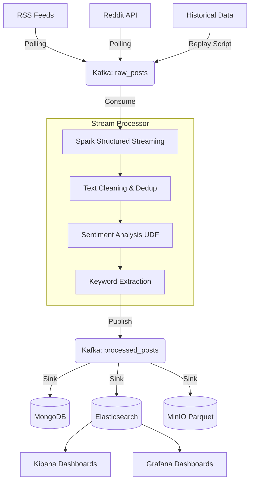

# Social Media Analytics - Architecture

This document describes the Kappa architecture implemented in this project for real-time social media analytics.

## Kappa Architecture Overview
Unlike Lambda architecture which maintains both a batch and a streaming layer, the **Kappa architecture** treats everything as a stream. Data is ingested as streams, processed in real-time, and served to the user. If historical data needs to be reprocessed, it is simply replayed through the same stream processing engine.

## Data Flow Diagram

## Component Details

### 1. Ingestion Layer (Collectors)
- **RSS Collector**: Periodically fetches news from predefined RSS feeds (e.g., VnExpress, Tuoi Tre). Implements exponential backoff on failure.
- **Reddit Collector**: Fetches recent submissions from specific subreddits using the `praw` API.
- **Message Broker**: **Apache Kafka** serves as the central nervous system. It buffers incoming `raw_posts` and decouples ingestion from processing.

### 2. Stream Processing Layer
- **Apache Spark**: Runs `stream_processor.py`. It consumes micro-batches from Kafka.
- **Processing Steps**:
  - Drops duplicate posts based on ID.
  - Cleans HTML tags and normalizes whitespace.
  - Passes text through `TextBlob` (via a Python UDF) to calculate Sentiment (Positive/Negative/Neutral).
  - Extracts trending keywords for future aggregations.

### 3. Storage Layer
We utilize polyglot persistence to serve different query needs:
- **Elasticsearch**: Optimized for full-text search and aggregations. Kibana and Grafana use this index (`processed_posts`) to render real-time dashboards.
- **MongoDB**: Optimized for document retrieval and operational queries. Posts are stored with unique constraints on ID.
- **MinIO**: S3-compatible object storage. Spark writes the processed streams as compressed `.parquet` files for long-term "cold" storage and future batch analytics/ML training.

### 4. Serving & Visualization Layer
- **Grafana**: Auto-provisioned with an Elasticsearch datasource and a default dashboard to show Post Volume and Sentiment Distribution.
- **Kibana**: Provides deep search capabilities (Discover tab) to query specific content across all ingested news and posts.

## Deployment Strategy
Currently, the pipeline is designed to run locally using Docker Compose for infrastructure, and local Python environments for the collectors and Spark jobs. Kubernetes manifests (`k8s/`) are provided as a skeleton for future scalable deployments.
