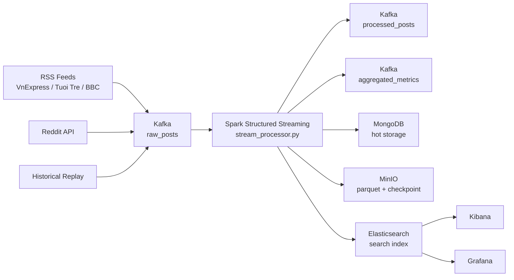
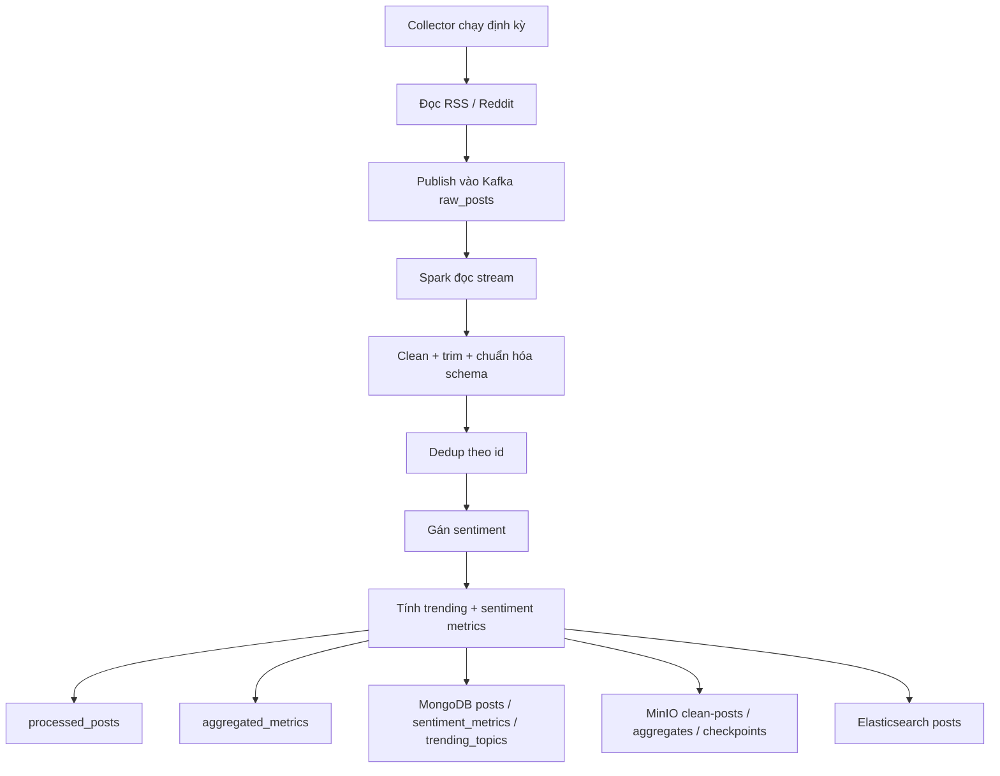

# Demo End-to-End

## Mục tiêu

Demo ngắn gọn luồng hoàn chỉnh của dự án:

`RSS/Reddit -> Kafka -> Spark -> MongoDB / MinIO / Elasticsearch -> Kibana / Grafana`

---

## 1. Kiến trúc hệ thống



---

## 2. Pipeline dữ liệu



---

## 3. Chuẩn bị demo

```bash
cd /Volumes/plxg2/Project/bigdata/social-media-analytics-pipeline
docker compose up -d
.venv/bin/python scripts/healthcheck.py
.venv/bin/python batch_tools/create_topics.py
.venv/bin/python scripts/init_elasticsearch.py
.venv/bin/python scripts/init_mongodb.py
```

Kỳ vọng:
- `kafka: ok`
- `mongodb: ok`
- `elasticsearch: ok`
- `minio: ok`

---

## 4. Chạy demo

### Terminal 1: Spark

```bash
cd /Volumes/plxg2/Project/bigdata/social-media-analytics-pipeline
source .venv/bin/activate
RESET_CHECKPOINT_ON_START=true spark-submit \
  --packages org.apache.spark:spark-sql-kafka-0-10_2.12:3.5.1,org.elasticsearch:elasticsearch-spark-30_2.12:8.10.0,org.apache.hadoop:hadoop-aws:3.3.4 \
  spark_jobs/stream_processor.py
```

### Terminal 2: RSS collector

```bash
cd /Volumes/plxg2/Project/bigdata/social-media-analytics-pipeline
.venv/bin/python collectors/rss_collector.py
```

Đợi log:
- `Feed VnExpress: Fetched ...`
- `Feed Tuoi Tre: Fetched ...`
- `Feed BBC Vietnamese: Fetched ...`

---

## 5. Mở UI để trình bày

- Kafka UI: `http://localhost:8080`
- MinIO: `http://localhost:9001`
- Kibana: `http://localhost:5601`
- Grafana: `http://localhost:3000`

---

## 6. Thứ tự demo chuẩn

### 6.1 Kafka UI

Cho xem:
- `raw_posts`: dữ liệu thô vừa crawl
- `processed_posts`: dữ liệu đã qua Spark, có `sentiment`
- `aggregated_metrics`: dữ liệu tổng hợp

### 6.2 MinIO

Cho xem các bucket:
- `clean-posts`
- `aggregates`
- `checkpoints`

Ý nghĩa:
- `clean-posts`, `aggregates`: lưu trữ dài hạn
- `checkpoints`: state kỹ thuật của Spark

### 6.3 Kibana

Vào `Discover`:
- Data view: `posts`
- Timestamp field: `published_at`

Cho xem:
- `title`
- `source`
- `feed_name`
- `sentiment`

### 6.4 Grafana

Đăng nhập:
- user: `admin`
- password: `admin`

Cho xem dashboard:
- `Social Media Analytics`

---

## 7. Cách nói ngắn gọn

> Hệ thống thu thập dữ liệu RSS/Reddit theo thời gian thực, đẩy vào Kafka. Spark Structured Streaming đọc dữ liệu từ `raw_posts`, làm sạch, dedup, phân tích sentiment và tạo metric tổng hợp. Kết quả được ghi ra Kafka đầu ra, MongoDB, MinIO và Elasticsearch; sau đó quan sát qua Kafka UI, Kibana và Grafana.

---

## 8. 3 điểm cần chứng minh

- `raw_posts` có dữ liệu mới
- `processed_posts` có dữ liệu đã xử lý
- MinIO hoặc Kibana có dữ liệu đầu ra

Nếu đủ 3 điểm này thì demo end-to-end đã pass.
